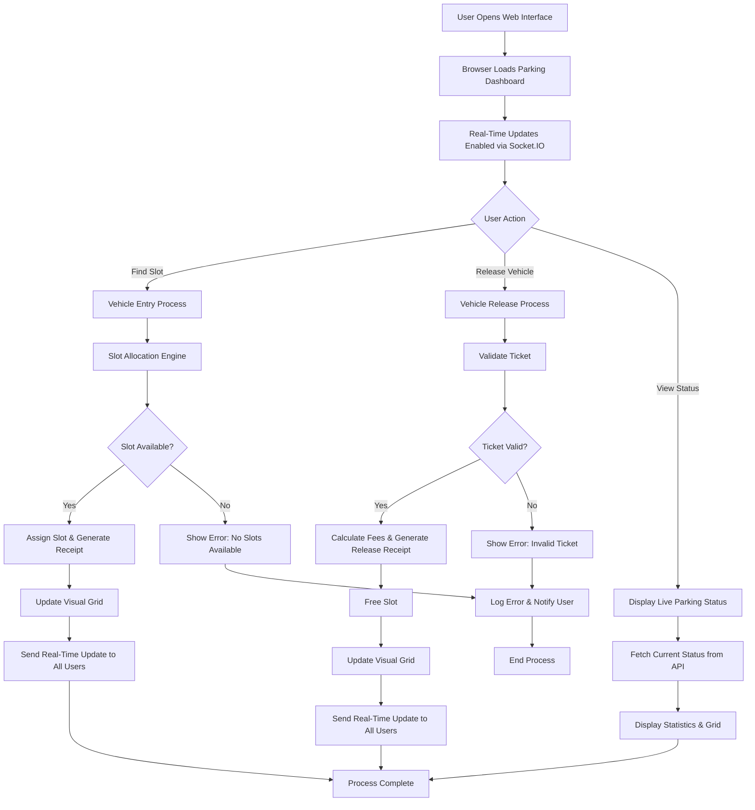

# Parking Management System 

## Welcome to the Parking Management System!

This is a modern, real-time parking management system that helps manage parking slots for different types of vehicles. Whether you're a parking lot operator or just curious about how smart parking works, this guide will walk you through everything you need to know.

## What This System Does

Imagine a parking lot with 186 parking spaces across 2 levels. This system:

- **Automatically assigns parking spots** to vehicles based on their size and type
- **Handles different customer types** - regular customers and VIP members
- **Works in real-time** - updates happen instantly as cars come and go
- **Generates receipts** with QR codes for easy verification
- **Provides a beautiful web interface** to see the parking lot status
- **Supports special features** like electric vehicle charging and VIP monthly passes
- **Operates 24/7** - no closing times!

## System Requirements

### Software You Need

**Python 3.8 or higher** - The main programming language used
- Download from: https://www.python.org/downloads/

**Web Browser** - Any modern browser like Chrome, Firefox, or Edge

### Optional but Recommended

**Git** - For downloading the code
- Download from: https://git-scm.com/downloads

## Step-by-Step Setup Instructions

### Step 1: Download the System

1. Open your web browser
2. Go to [https://github.com](https://github.com/Ghost24into7/AutoParq) (or wherever this code is hosted)
3. Download the ZIP file or clone the repository
4. Extract the ZIP file to a folder on your computer (like `C:\ParkingSystem` or `/home/user/ParkingSystem`)

### Step 2: Install Python

If you don't have Python installed:

1. Go to https://www.python.org/downloads/
2. Download the latest version for your operating system
3. Run the installer
4. **Important**: Make sure to check "Add Python to PATH" during installation

### Step 3: Install Required Software

1. Open a command prompt/terminal:
   - **Windows**: Press Windows key + R, type `cmd`, press Enter
   - **Mac**: Press Command + Space, type `Terminal`, press Enter
   - **Linux**: Press Ctrl + Alt + T

2. Navigate to the folder where you extracted the code:
   ```
   cd C:\ParkingSystem
   ```
   (Replace `C:\ParkingSystem` with your actual folder path)

3. Install the required Python packages:
   ```
   pip install flask flask-socketio python-socketio eventlet
   ```
   OR
    ```
   pip install requirements.txt
   ```
### Step 4: Run the System

1. In the command prompt/terminal, make sure you're in the correct folder
2. Type this command and press Enter:
   ```
   python run.py
   ```

3. You should see messages like:
   ```
   Starting Parking Management System on port 5000
   * Running on http://127.0.0.1:5000
   ```

4. Open your web browser and go to: http://127.0.0.1:5000

**Congratulations!** Your parking system is now running!

## How to Use the System

### The Main Interface

When you open the web page, you'll see:

- **Parking Lot Visualization**: A colorful grid showing all parking spaces
- **Vehicle Request Form**: Where you enter vehicle information
- **Status Information**: Current counts of occupied/available spaces
- **Rules and Pricing**: Information about costs and policies

### Parking a Vehicle

1. **Choose Vehicle Type**:
   - Small (motorcycles, compact cars)
   - Medium (sedans, SUVs)
   - Large (trucks, vans)

2. **Choose Customer Type**:
   - Regular: Standard parking with hourly limits
   - VIP: Special members with monthly passes

3. **Enter License Plate**: The vehicle's registration number (e.g., ABC-123)

4. **Check Electric Vehicle**: If it's an electric car that needs charging

5. **Click "Find Slot"**

The system will:
- Find the best available spot
- Show you the slot number and level
- Generate a parking ticket/receipt
- Update the visual display

### Releasing a Vehicle

1. **Enter the Ticket Number** in the release form
2. **Click "Release Vehicle"**
3. The system calculates any fees and shows a release receipt

### Understanding the Visual Display

- **Green squares**: Empty parking spaces
- **Red squares**: Occupied spaces
- **Different sections**: Regular, VIP, and EV (Electric Vehicle) areas
- **Two levels**: Ground floor and first floor

## Special Features Explained

### VIP Monthly Passes

VIP customers get special monthly passes that allow:

- **Unlimited parking** for 30 days
- **No daily fees** - pay once for the whole month
- **Priority parking** in VIP sections
- **Multiple entries/exits** anytime

**Pricing for VIP Monthly Passes**:
- Small vehicles: ₹1,050 (30 days)
- Medium vehicles: ₹2,100 (30 days)
- Large vehicles: ₹3,150 (30 days)

### Electric Vehicle Support

- Special EV charging spots available
- Priority allocation for electric vehicles
- Dedicated sections for charging

### Real-Time Updates

- The display updates automatically when vehicles park or leave
- Multiple people can view the system simultaneously
- Changes appear instantly without refreshing the page

### QR Code Receipts

Every parking receipt includes a QR code that can be:
- Scanned with a phone camera
- Used for digital verification
- Copied to clipboard for easy sharing

## System Architecture



### How It Works Internally

1. **Web Server**: Handles web page requests and real-time updates
2. **Real-Time Engine**: Updates the display instantly for all viewers
3. **Slot Manager**: Finds the best parking spot based on rules
4. **VIP System**: Manages monthly passes and special privileges
5. **Receipt System**: Creates professional receipts with QR codes

## Production Deployment

### Deploying to Cloud Platforms (Render.com, Heroku, etc.)

When deploying to production platforms like Render.com, you may encounter a Werkzeug security error. To fix this:

1. **Modify the `socketio.run()` call** in `parking_service.py`:
   ```python
   socketio.run(app, host='0.0.0.0', port=int(os.environ.get('PORT', 5000)), debug=False, allow_unsafe_werkzeug=True)
   ```

2. **Environment Variables**:
   - Set `PORT` environment variable (platform default, usually 5000)
   - Ensure Python 3.8+ is used

3. **Required Packages** for production:
   ```bash
   pip install flask flask-socketio python-socketio eventlet gunicorn
   ```

**Note**: The `allow_unsafe_werkzeug=True` parameter is required for Flask-SocketIO to work in production environments where Werkzeug's development server restrictions apply.

### System Won't Start

**Problem**: "python is not recognized"
**Solution**: Make sure Python is installed and added to PATH. Try `python3` instead of `python`.

**Problem**: "Module not found" errors
**Solution**: Run `pip install flask flask-socketio python-socketio eventlet`

### Web Page Doesn't Load

**Problem**: Browser shows "connection refused"
**Solution**: Make sure the system is running (you should see "Running on http://127.0.0.1:5000")

**Problem**: Page loads but looks wrong
**Solution**: Try refreshing the page (F5) or clearing browser cache

### Parking Requests Fail

**Problem**: "No slot available"
**Solution**: All 186 spaces might be occupied, or no suitable spot for that vehicle type

**Problem**: "Vehicle already parked"
**Solution**: That license plate is already in use. VIP customers can have multiple vehicles.

## Advanced Features

### For Developers

The system is built with:
- **Python Flask**: Web framework
- **Socket.IO**: Real-time communication
- **Bootstrap**: Beautiful user interface
- **QRCode.js**: QR code generation
- **jsPDF**: PDF receipt creation

### Customization

You can modify:
- Number of parking levels
- Pricing rates
- Time limits
- VIP benefits
- Visual appearance

### Data Storage

Currently uses memory storage (resets when restarted). For production, you could add:
- Database storage (SQLite, PostgreSQL)
- User accounts
- Payment integration
- Mobile app

## Design Improvements Over Basic Version

The original assignment was very basic - just console output with simple slot allocation. This version includes major improvements:

### 1. Real-Time Web Interface
**Old**: Console logs only
**New**: Beautiful web dashboard with live updates
**Benefit**: Multiple users can monitor simultaneously, much more user-friendly

### 2. Advanced Slot Allocation
**Old**: Basic first-available slot
**New**: Priority-based allocation (VIP first, EV priority, level preferences)
**Benefit**: Better utilization and customer satisfaction

### 3. VIP Monthly Pass System
**Old**: No VIP features
**New**: Complete monthly pass system with unlimited parking
**Benefit**: Recurring revenue and premium customer service

### 4. Receipt Generation
**Old**: No receipts
**New**: Professional receipts with QR codes and PDF generation
**Benefit**: Legal compliance and customer convenience

### 5. Real-Time Communication
**Old**: Synchronous processing
**New**: WebSocket-based real-time updates
**Benefit**: Instant feedback and live monitoring

### 6. Comprehensive Rules Engine
**Old**: Basic constraints
**New**: Full policy management with re-entry rules, penalties, restrictions
**Benefit**: Handles complex real-world scenarios

### 7. 24/7 Operation
**Old**: No time considerations
**New**: Always available, no operating hour restrictions
**Benefit**: Modern parking lot requirements

### 8. Multi-Level Support
**Old**: Single level
**New**: Two-level parking with proper navigation
**Benefit**: Scalable for larger facilities

### 9. Electric Vehicle Support
**Old**: No EV features
**New**: Dedicated EV sections and charging support
**Benefit**: Future-ready for electric vehicles

### 10. Error Handling and Logging
**Old**: Basic error handling
**New**: Comprehensive logging and graceful error recovery
**Benefit**: Reliable operation and debugging

## Performance and Scalability

- **Handles 186 parking spaces** efficiently
- **Real-time updates** for multiple concurrent users
- **Thread-safe operations** for simultaneous requests
- **Memory efficient** data structures
- **Extensible design** for adding more features

## Future Enhancements

Potential improvements you could add:
- User authentication and accounts
- Payment gateway integration
- Mobile app companion
- Camera integration for license plate recognition
- Reservation system
- Analytics and reporting
- Multi-language support

## Support and Contact

If you encounter issues:
1. Check the troubleshooting section above
2. Review the console output for error messages
3. Ensure all requirements are installed correctly
4. Try restarting the system

## License and Usage

This system is provided as-is for educational and demonstration purposes. Feel free to modify and improve it for your needs!

---

**Last Updated**: November 13, 2025
**Version**: 2.0 - Advanced Real-Time Parking System
